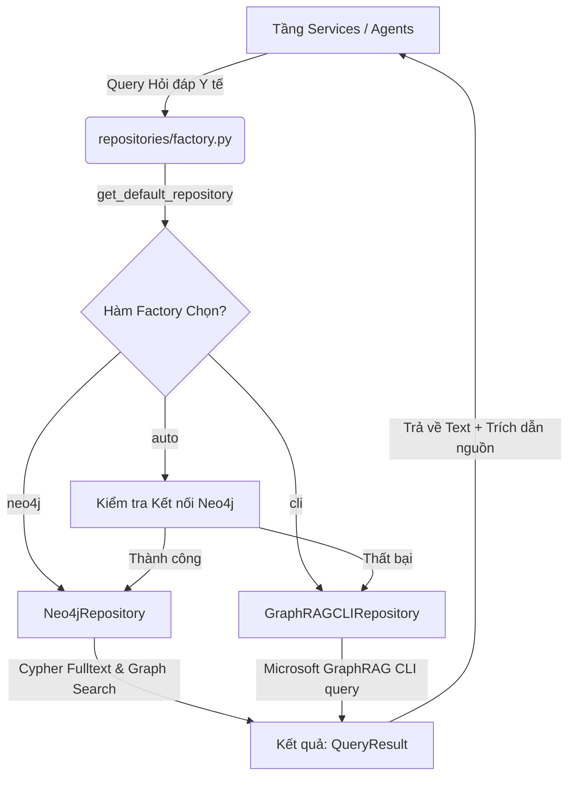

# 📁 Phân hệ Repositories — Kiến trúc Kết nối Cơ sở Tri thức CDSS

Phân hệ `repositories/` chịu trách nhiệm đóng gói toàn bộ logic truy vấn dữ liệu từ các nguồn tri thức khác nhau (Đồ thị Neo4j, Microsoft GraphRAG, v.v.) theo thiết kế mẫu **Repository Pattern**. Điều này giúp tách biệt hoàn toàn tầng logic nghiệp vụ của tác nhân (Agent) và các API dịch vụ khỏi hạ tầng dữ liệu cụ thể phía dưới.

---

## 🏗️ Tổng quan Kiến trúc & Sơ đồ Luồng

Hệ thống hỗ trợ cơ chế truy vấn lai động (Dynamic Hybrid Retrieval), cho phép tự động phát hiện trạng thái hoạt động của cơ sở dữ liệu đồ thị Neo4j để đưa ra quyết định chuyển hướng (Fallback) thông minh:



---

## 🗂️ Danh sách các Thành phần

| Tệp tin | Vai trò & Trách nhiệm | Chi tiết kỹ thuật |
| :--- | :--- | :--- |
| **[base.py](file:///d:/DATN/repositories/base.py)** | Định nghĩa lớp cơ sở trừu tượng (Abstract Base Class) | Khai báo cấu trúc dữ liệu trả về `QueryResult` (gồm văn bản `text` và danh sách nguồn trích dẫn `sources`) và interface `KnowledgeRepository`. |
| **[factory.py](file:///d:/DATN/repositories/factory.py)** | Quản lý vòng đời và cấp phát thực thể (Factory Class) | Cung cấp hàm `get_default_repository()` để tự động nhận dạng môi trường, ưu tiên Neo4j và tự động chuyển sang CLI làm phương án dự phòng. |
| **[neo4j_repo.py](file:///d:/DATN/repositories/neo4j_repo.py)** | Tương tác trực tiếp với Cơ sở dữ liệu đồ thị Neo4j | Thực thi các truy vấn Cypher tối ưu hóa (kết hợp Fulltext Index và đồ thị láng giềng) trên tập dữ liệu đồ thị thực thể y khoa khổng lồ. |
| **[graphrag_cli_repo.py](file:///d:/DATN/repositories/graphrag_cli_repo.py)** | Dự phòng truy xuất qua Microsoft GraphRAG CLI | Khởi chạy tiến trình con GraphRAG để tìm kiếm ngữ cảnh cục bộ hoặc toàn cục khi database đồ thị gặp sự cố hoặc ngoại tuyến. |

---

## 🚀 Hướng dẫn Sử dụng trong Code

Để tích hợp cơ sở tri thức vào bất kỳ module dịch vụ nào, bạn chỉ cần sử dụng hàm Factory được cung cấp sẵn với cơ chế Dependency Injection của FastAPI:

```python
from fastapi import Depends
from repositories.base import KnowledgeRepository
from repositories.factory import get_default_repository

# Sử dụng Dependency Injection trong router FastAPI
@router.get("/api/query")
async def query_knowledge(
    question: str,
    repo: KnowledgeRepository = Depends(get_default_repository)
):
    # Hệ thống sẽ tự động chọn Neo4j (nếu online) hoặc GraphRAG CLI (nếu offline)
    result = await repo.query(question)
    return {
        "answer": result.text,
        "citations": result.sources
    }
```

---

## 💡 Các Điểm Lưu ý & Best Practices

> [!TIP]
> **Hiệu năng và Nguồn dẫn**: 
> Sử dụng `Neo4jRepository` luôn mang lại tốc độ truy vấn vượt trội (độ trễ milisecond) và trích dẫn thực thể đồ thị cực kỳ chính xác nhờ việc lập chỉ mục (Fulltext Indexes) trên Neo4j.

> [!WARNING]
> **Dự phòng GraphRAG CLI**:
> `GraphRAGCLIRepository` sử dụng cơ chế gọi câu lệnh CLI qua tiến trình con (Subprocess), do đó có thể gây tăng thời gian phản hồi (Latency) khi chạy luồng phân tích sâu. Khuyến nghị chỉ sử dụng làm phương án fallback.

---

## 📈 Định hướng Nâng cấp Tiếp theo

1. **Hybrid Retrieval (Truy xuất lai đa tầng)**: Kết hợp tìm kiếm đồ thị (Graph Search), tìm kiếm từ khóa truyền thống (BM25) và tìm kiếm Vector (Dense Embeddings) dưới cùng một giao diện Repository duy nhất.
2. **Normalized Scoring**: Chuẩn hóa thuật toán tính điểm tin cậy (Confidence score) giữa Neo4j Cypher và GraphRAG CLI để việc xếp hạng nguồn trích dẫn y khoa được chuẩn xác nhất.
3. **Caching Layer**: Bổ sung phân lớp Cache lưu trữ cặp `(query, QueryResult)` sử dụng Redis/In-memory để tăng tốc độ phản hồi đối với các câu hỏi trùng lặp thường gặp.
